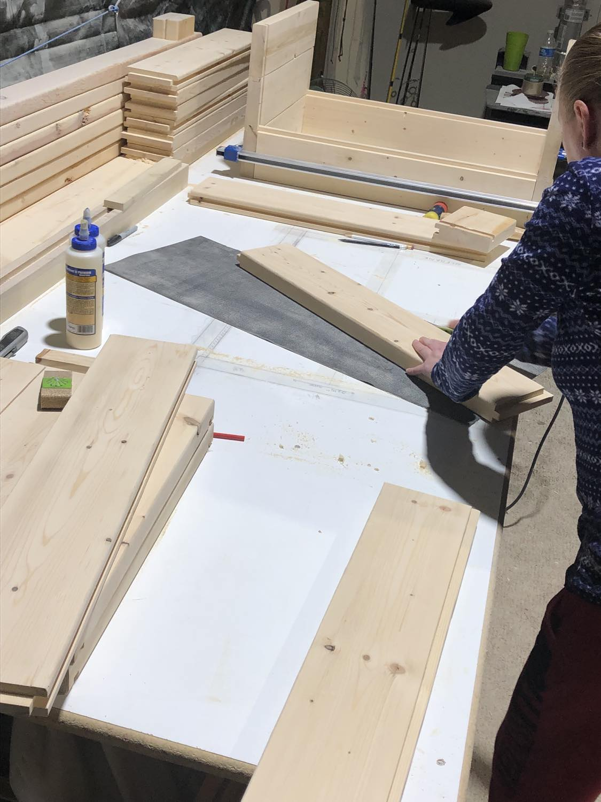

 

### **Our Mission 🐝**

With the rapid decline of bee populations over recent years, our mission is to help the bees. For our beloved planet earth to “bee” healthy and safe, we provide bees with affordable and sustainable housing where they can thrive and multiply.

We design, cut and construct these hives in our wood shop at home!   

We wanted these hives to have the features most don’t and to be as beautiful to look at as they are functional.

 

### **Contact Info**

**Phone Number:** 1-(917)-519-0679

**Email:** lyalya7@yahoo.com

Here's some photos of us at work 😀:

{width=33%}
{width=33%}
{width=33%}