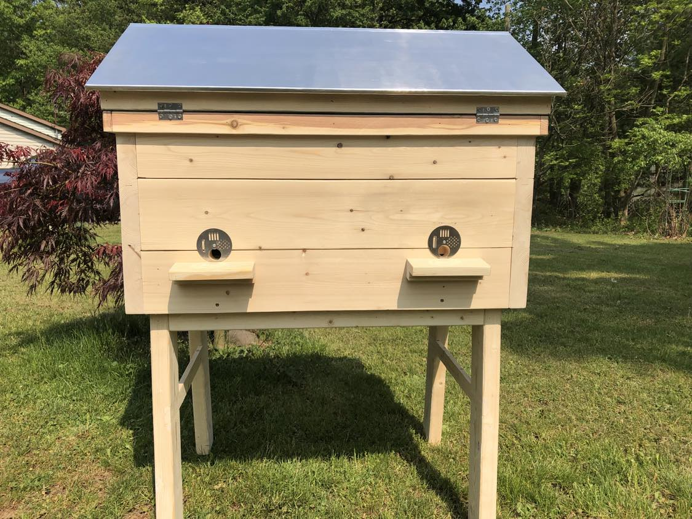
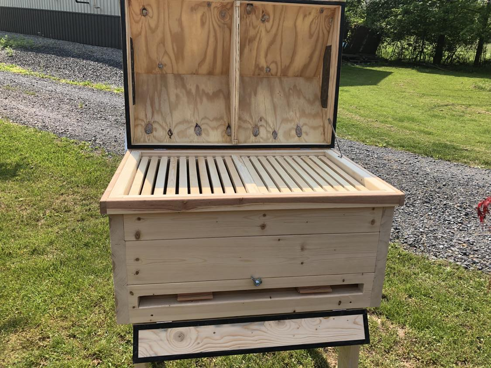
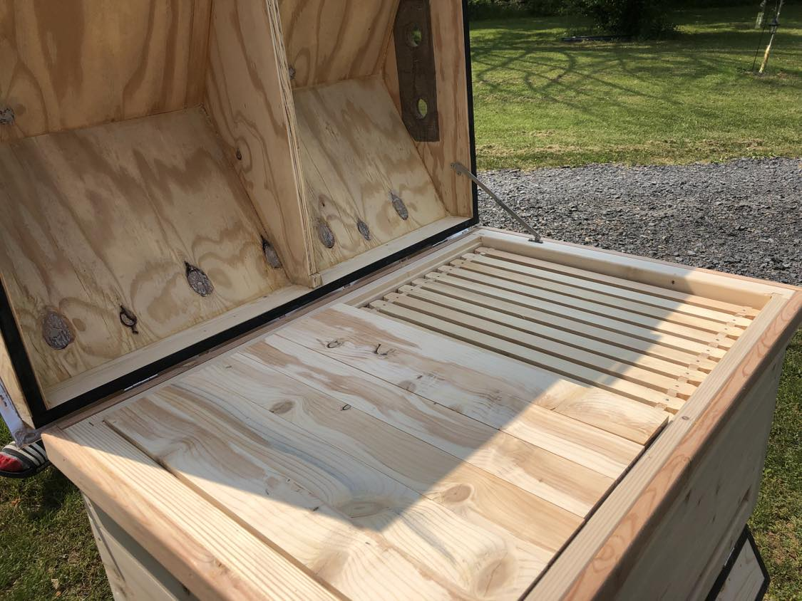
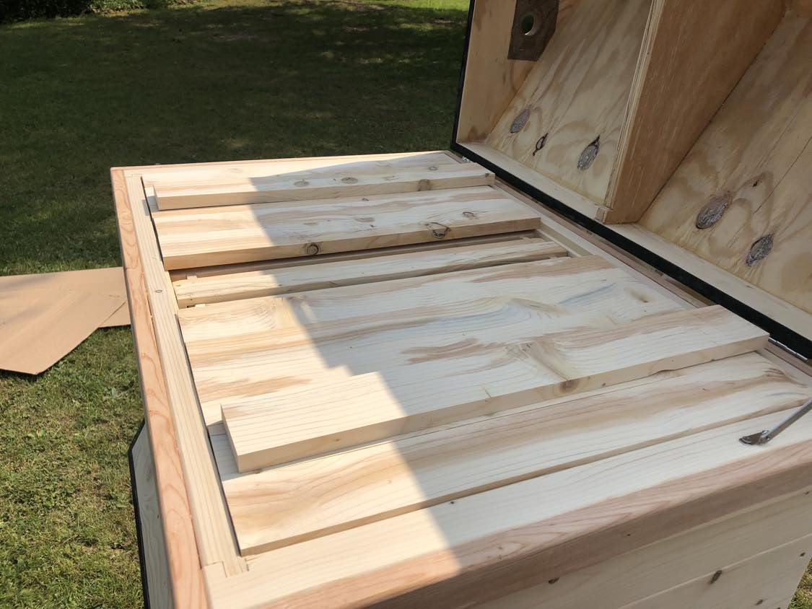

 
 

### **LANGSTROTH HORIZONTAL - 21 FRAME BEEHIVE**

{width=45%}
{width=45%}

{width=45%}
{width=45%}

#### **DETAILS:**

***Handmade Beehive!***

The body is cut from 2” x 6” pine lumber. 

The top is made of a lighter plywood construction with a locking hinge so that you can check on your bees with minimal disruption. 

This horizontal hive is designed to fit 21 American deep frames w/o dividers or 20 frames with the included divider board. The American deep frames shown in pictures are not included.

+ Includes all classic features listed below
+ Slanted roof to shed rain water away from the front of the hive
+ Vents to help with heating and cooling of hive
+ Hive top is easy to lift open 
+ A-Frame design allows for use of top feeders

Classic Features: 

+ Holds 21 frames (not included)
+ Less hive damage
+ No heavy lifting
+ Easy to inspect
+ 1.5-inch thick hive walls provide durability and insulation 
+ Hive beatle screened bottom 
+ Bee porch
+ Divider board
+ Two catch trays accessible from rear of hive 
+ 23” high legs makes easy hive visits and no unwanted pests to worry about
+ Vented and screened roof and floor to keep out pests
+ Also included are top frame covers that allow bees to move across top of frames while keeping them from accessing the roof and also aid in air circulation so you can work in sections. 

The pine wood exterior comes untreated so you can select from any of the below customizations:

+ Paint it with non-toxic water based paint

+ Treat it with beeswax 

+ Treat it with linseed oil

#### **DIMENSIONS**
**Overall:** 34.5" in length X 25" in width X 45.5" in height
**Just the box:** 32" in length X 21.25" in width X 15.5" in height
**Weight:** ~70 pounds

#### **SHIPPING**

+ Free delivery within 50 miles range of Stroudsburg, PA 18360

+ Free local pickup from Stroudsburg, PA 18360

**If you are interested in purchasing this hive and your location is over 50 miles away from Stroudsburg, PA, we will not be able to ship it and you will have to make your own arrangements for shipping. You can contact us with any questions and we will assist in any way possible.**

Our contact info can be found in *this tab*.